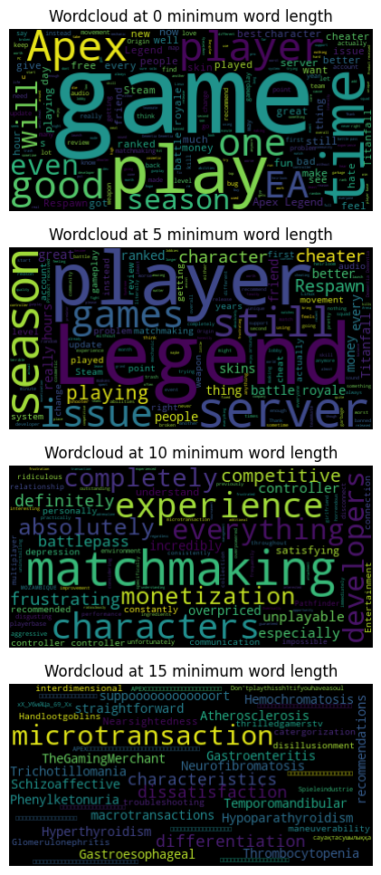
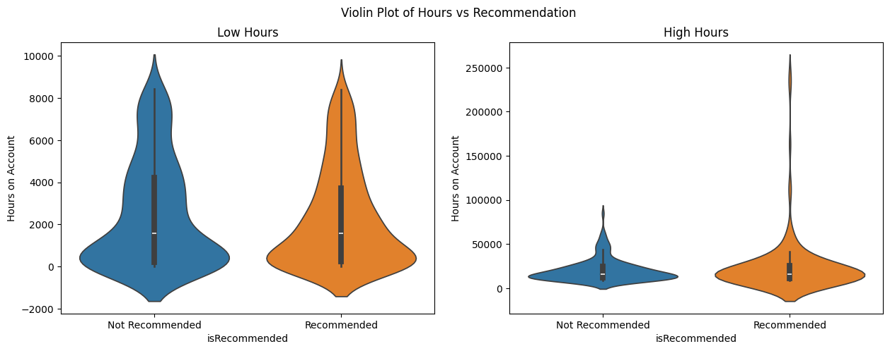
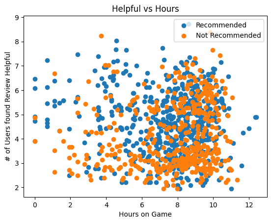
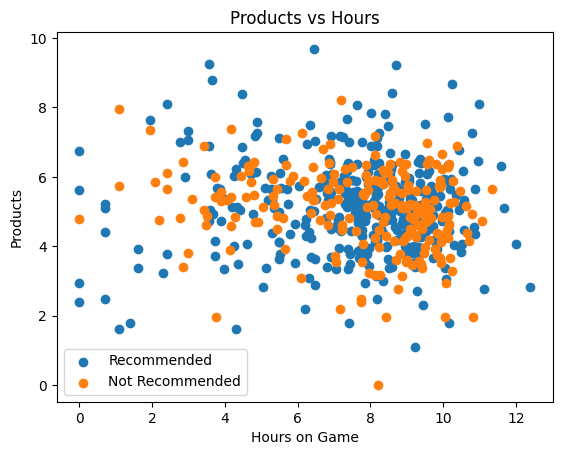
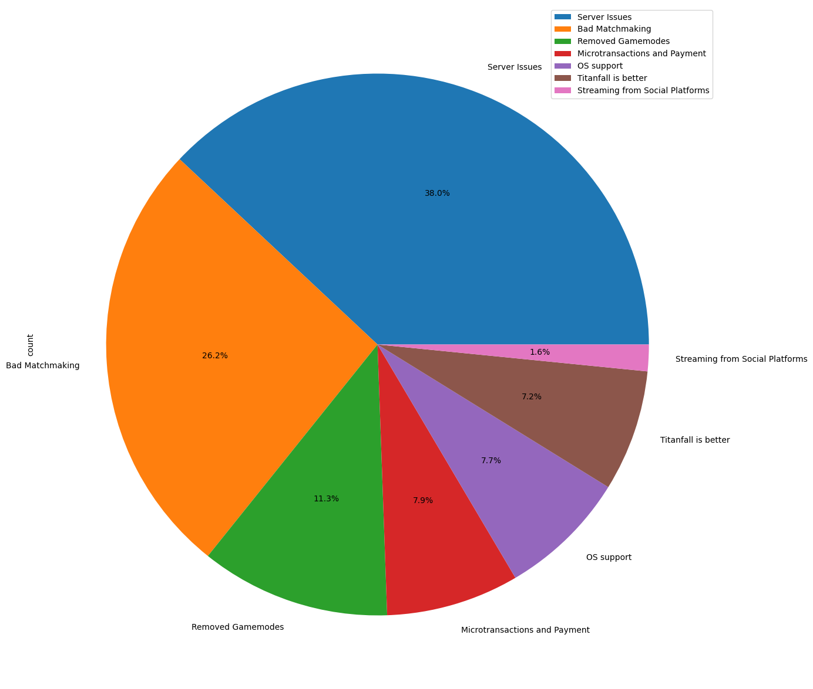

# About Me
I am JR Kayle S. Gamundoy, a 4th Year Data Science Student currently studying at the Technological Institute of the Philippines - Quezon City Branch.

---
# My Projects
## Marketing A/B Test Analysis

### Project Description
A simple A/B Test analysis where I utilize the "Marketing A/B Testing Dataset" by FavioVázquez to generate graphs that emphasize insights that the company could use. Using these insights, we propose actions that the company should take in order to significantly benefit the company. It involves inspecting the dataset and comparing the key performance metric, which is the customer conversion rate, of both groups: Advertisement (Ad) Group and Public Service Announcement (PSA) group. After deciding which group is more effective, we also aim to optimize customer engagement by analyzing which hours of each day have the highest customer engagement, this way, we can not only choose the best method of reaching the company customers, but also minimize costs by picking hours where the majority of customers have reported to have engaged with our advertisements/announcements.

### Images

---
## Apex Steam Reviews Analysis

### Project Description
This project was my very first project and it started out as a simple investigation of one of my favorite games that I played when I was young so it may not be as professional as others but nonetheless it is something that I worked on. It worked on analyzing steam reviews of Apex Legends through various methods including topic extraction and word clouds. Being one of the games that I really enjoyed, I wanted to pinpoint the key changes that majority of the playerbase of Apex Legends really didn't like: the patch changes in which the game plummetted in both sales and player activity. To accomplish this, I gathered the reviews using a web scraper that is separated on a different notebook under the same directory. After gathering the data, I utilized word clouds and topic extraction to see whether I can gain some insight on the words used in all the reviews. I also attempted to filter the reviews by various factors including but not limited to hours on account, community votes, or helpful votes made by other users. I tried finding whether there was a common characteristic shared by those who recommended the game against those that did not. My analysis ended with majority of the playerbase pointing to an intense dislike towards matchmaking, server issues, and microtransactions. The constant push of the developers to these three fields seemingly caused the playerbase to drop the game, venting their frustration on the reviews at how the developers hardly cared for the state of the game and only for making money off of it.

### Images

---
## Philippine Social Media Fake News Detection

### Project Description
A simple fake news detection that predicts whether or not a given social media post is likely authentic or fake. The program works by inputting the post content and the author of the post, then it predicts after the user clicks a button to initiate the model prediction. In addition, the user can train a custom model by providing specific parameters for the model creation or by adding datasets to the dataset directory and customizing the train.py file to process the added datasets for training in the appropriate section. The model used for the program can be chosen from a database of trained models.

### Images

